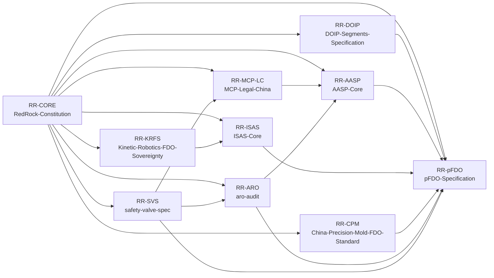

# Ecosystem Graph (CN/EN) / 生态关系图（中英双语）

Updated: 2026-02-22

## Overview / 总览

- CN: 该图定义了 RedRock 仓库群在协议、治理、审计与安全阀层面的逻辑关系。
- EN: This graph defines protocol, governance, audit, and safety-valve relationships across the RedRock repository ecosystem.

## Relationship Notes / 关系说明

- `RR-CORE` (RedRock-Constitution) is the governance and registry hub.
- `RR-pFDO` is the physical-layer implementation focus and consumes standards from `RR-DOIP`, `RR-AASP`, and `RR-ISAS`.
- `RR-ARO` provides evidence-layer audit verification.
- `RR-SVS` enforces action-boundary safety via receipts and conformance checks.

## Mermaid / 关系图

